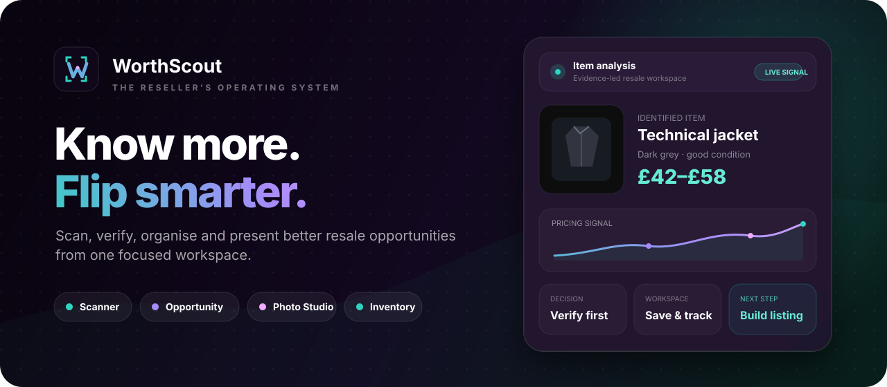
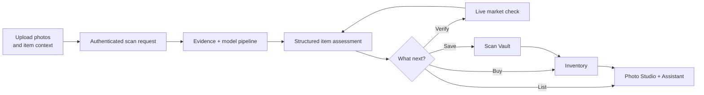
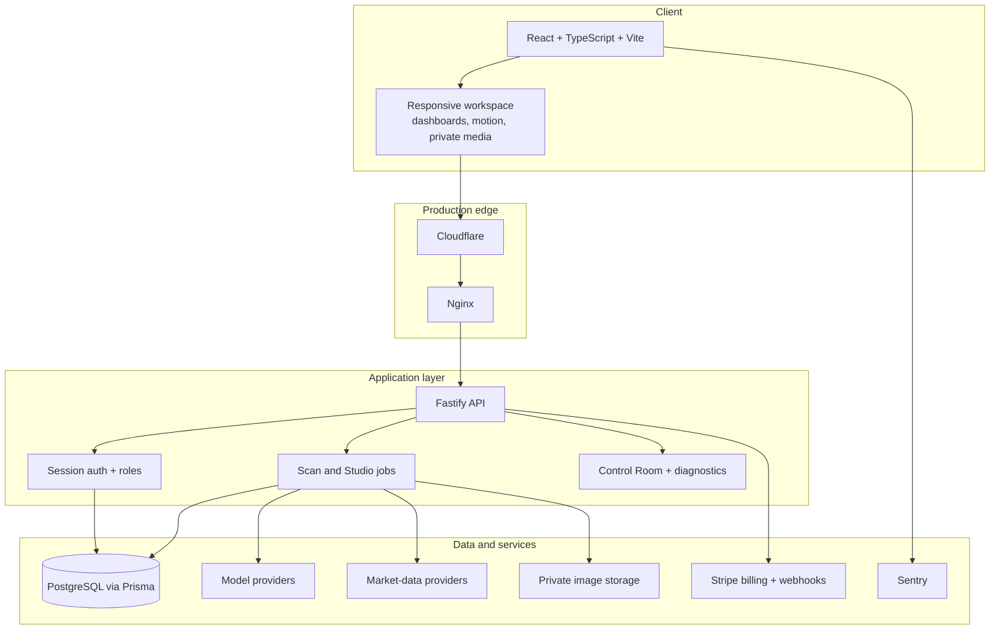

  

   

  <a href="https://worthscout.co.uk"><strong>Launch WorthScout ↗</strong></a>
  &nbsp;&nbsp;·&nbsp;&nbsp;
  <a href="https://gurnski.github.io/worthscout-public/"><strong>Interactive showcase ↗</strong></a>
  &nbsp;&nbsp;·&nbsp;&nbsp;
  <a href="#how-it-works"><strong>How it works</strong></a>

    

  
  
  
  
  
  

---

# WorthScout

**WorthScout is the reseller's operating system:** a focused workspace for evaluating potential buys, checking pricing evidence, improving listing photos, organising stock and keeping the commercial side of reselling in one place.

Instead of treating sourcing, scanning, verification, listing preparation and inventory as disconnected jobs, WorthScout connects them into one practical loop:

> **discover → assess → verify → organise → present → sell**

> [!IMPORTANT]
> This is a **public product showcase**. The commercial source code, infrastructure configuration, provider logic, internal prompts, credentials and production data remain private.

## Product workspace

<table>
  <tr>
    <td width="50%" valign="top">
      <h3>📷 Scanner</h3>
      Analyse one or multiple product photos, add useful context and receive a structured resale assessment before committing to a buy.
    </td>
    <td width="50%" valign="top">
      <h3>🔎 Opportunity Board</h3>
      Review curated resale leads using conservative pricing signals, explicit risk language and a verification-first workflow.
    </td>
  </tr>
  <tr>
    <td width="50%" valign="top">
      <h3>🗂️ Scan Vault</h3>
      Save previous scans, revisit assumptions and keep product research attached to the item instead of scattered across screenshots and notes.
    </td>
    <td width="50%" valign="top">
      <h3>📦 Inventory</h3>
      Move promising items into a stock workspace for purchase cost, pricing assumptions, listing progress and eventual sale tracking.
    </td>
  </tr>
  <tr>
    <td width="50%" valign="top">
      <h3>✨ Photo Studio</h3>
      Prepare cleaner, more consistent listing images while preserving the source item and keeping generated variants tied to the job.
    </td>
    <td width="50%" valign="top">
      <h3>💬 Assistant</h3>
      Ask follow-up questions about pricing, saved products and listings from inside the same resale workspace.
    </td>
  </tr>
</table>

## How it works

The interface is built around **decisions**, not raw model output. An estimate is treated as a signal to investigate—not proof that an item will sell for a particular price.

## System architecture

## Product principles

### Signal, not proof

WorthScout avoids presenting uncertain evidence as guaranteed profit. Opportunity estimates are conservative, weak evidence is labelled honestly and market verification remains a separate step.

### Credit integrity

Paid actions use an auditable credit ledger, atomic deductions and idempotent fulfilment. Monthly allowances and purchased top-up balances remain separate.

### Private by default

Uploaded product images are authenticated and checked against per-object ownership. User data is isolated by account and operational errors are scrubbed before persistence or display.

### Observable operations

The private Control Room exposes provider health, background jobs, billing events, errors, notifications and site controls without requiring direct database access for routine investigation.

## Technology

| Layer | Foundation |
|---|---|
| Frontend | React, TypeScript, Vite, Tailwind CSS, Framer Motion, Radix UI |
| Backend | Node.js, Fastify, TypeScript, Zod, Pino |
| Data | PostgreSQL, Prisma ORM |
| AI and media | OpenAI integrations, Sharp, provider adapters |
| Payments | Stripe Checkout, subscriptions, credit packs and signed webhooks |
| Reliability | Vitest, Sentry, health checks, provider diagnostics and idempotency controls |
| Production | Cloudflare, Nginx, PM2, Linux VPS |

<strong>Engineering notes</strong>

 

- Public marketing pages are prerendered while the authenticated workspace remains application-driven.
- Uploaded images are served through authenticated application routes rather than public static storage.
- Payment fulfilment is webhook-driven and designed to remain safe under retries and event reordering.
- Long-running image jobs retain explicit lifecycle state so failure and refund paths remain inspectable.
- Operational events use bounded, redacted metadata instead of raw provider responses or user content.

## The build story

WorthScout began as an answer to a practical reseller problem: **too many decisions are made from fragmented information**.

A potential purchase might involve marketplace searches, mental arithmetic, screenshots, notes, image editing and a separate spreadsheet. WorthScout turns that fragmented process into a reusable product workflow while keeping uncertainty visible rather than hiding it behind a confident-looking score.

The project has developed through repeated production audits covering billing integrity, private uploads, provider reliability, conservative pricing, observability and deployment hardening.

## Repository scope

This repository contains public-facing product documentation, selected visual assets and a GitHub Pages presentation. It intentionally does **not** contain the commercial application's source code, secrets, internal prompts, provider credentials, infrastructure access or production data.

## Explore

### [Launch WorthScout](https://worthscout.co.uk) · [Open the interactive showcase](https://gurnski.github.io/worthscout-public/)

**Know more. Flip smarter.**

Built by **Daniel Rea**.

---

WorthScout is a closed-source commercial product. All product names, branding, interface designs and documentation in this repository are © Daniel Rea. No licence to reproduce the application or its proprietary implementation is granted.
